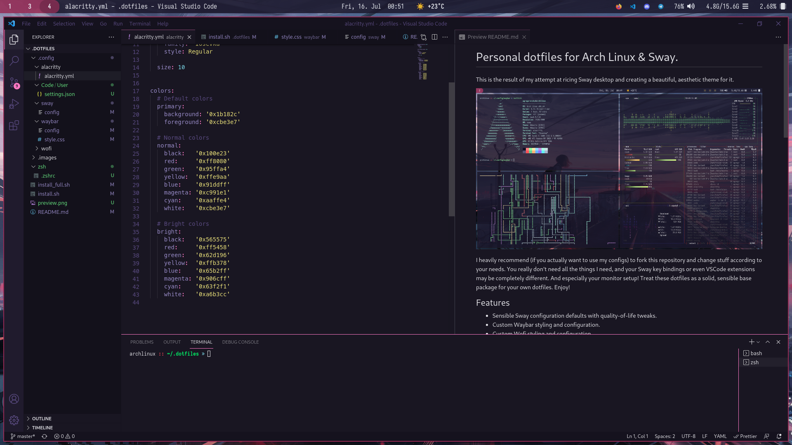

# Personal dotfiles for Arch Linux & Sway.

This is the result of my attempt at ricing Sway desktop and creating a beautiful, aesthetic theme for it.




I heavily recommend (if you actually want to use my configs) to fork this repository and change stuff according to your needs. You really don't need all the things I need, and your Sway key bindings or even VSCode extensions may be completely different. And especially your monitor setup!
Treat these dotfiles as a solid, sensible base package for your own dotfiles. Enjoy!

## Features

- Sensible Sway configuration defaults with quality-of-life tweaks.
- Custom Waybar styling and configuration.
- Custom Wofi styling and configuration.
- Alacritty styling and configuration.
- Matching wallpaper :)
- Fully fledged Arch & Sway installation scripts.
- Solid VSCode configuration and extension packages.
- Zsh & Oh My Zsh automatically configured with autocompletions and syntax highlighting on Cypher theme.
- Firefox, Telegram and Discord installed and configured for different workspaces.

## Installation

First install Git and clone the repository using the command below.

```
pacman -Sy git
git clone https://github.com/SocketByte/dotfiles
```

### Full Arch & Sway installation.

These scripts were made for configurability and flexibility, please configure them accordingly to your taste. **Especially your drive device name and partitioning**.

```
nano dotfiles/install_full.sh
```

_IMPORTANT_: If you're using a different user name than "user" you must also change the user name in the `/install.sh`.

When you're ready to go - just run the script and let the magic happen!

```
./dotfiles/install_full.sh
```

After installation the script will automatically reboot your PC.

### Only Sway

This is for people that are _very cool_ and made it past the Arch Way's installation process. This script will install Sway and other important utilities. (And dotfiles, of course)

Of course like in the full script - you really should look into what you're installing.

Running the script is magically easy!

```
./dotfiles/install.sh
```
